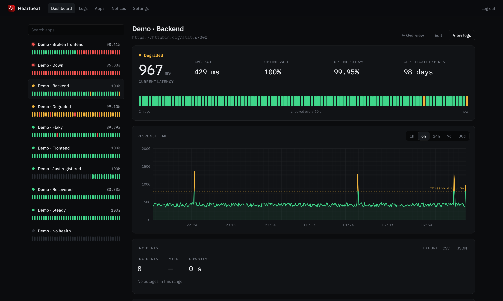
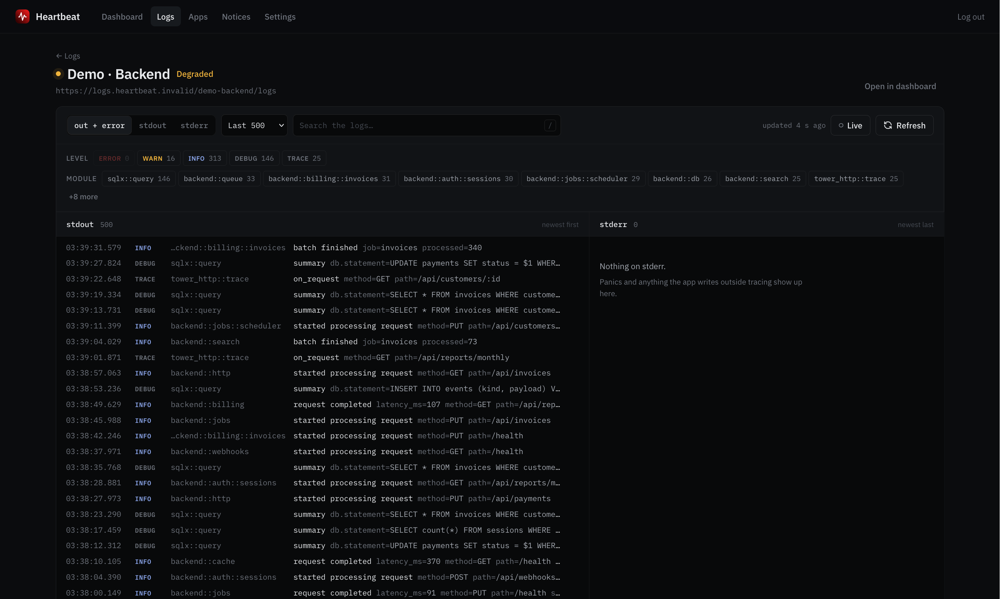
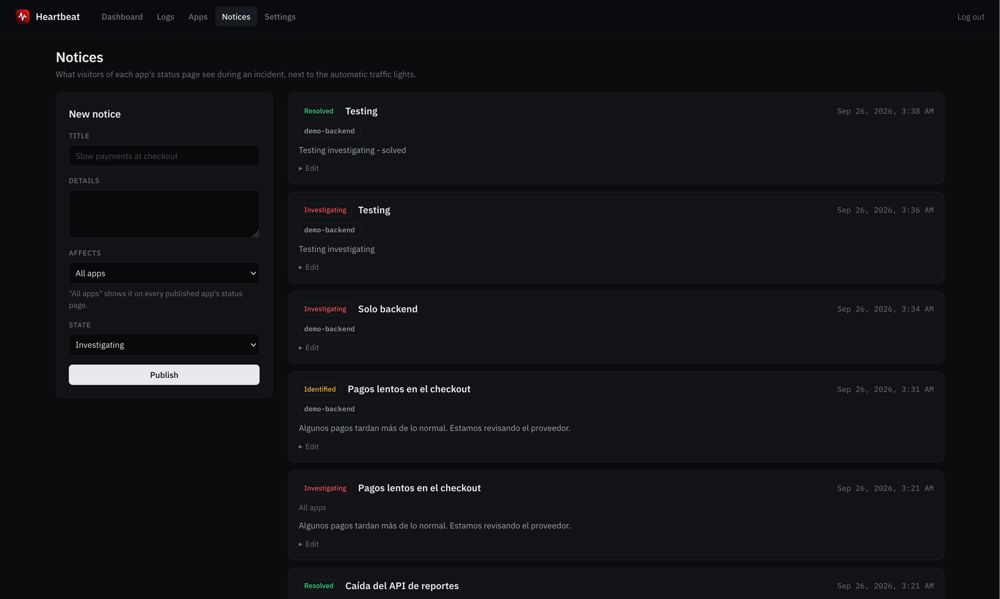
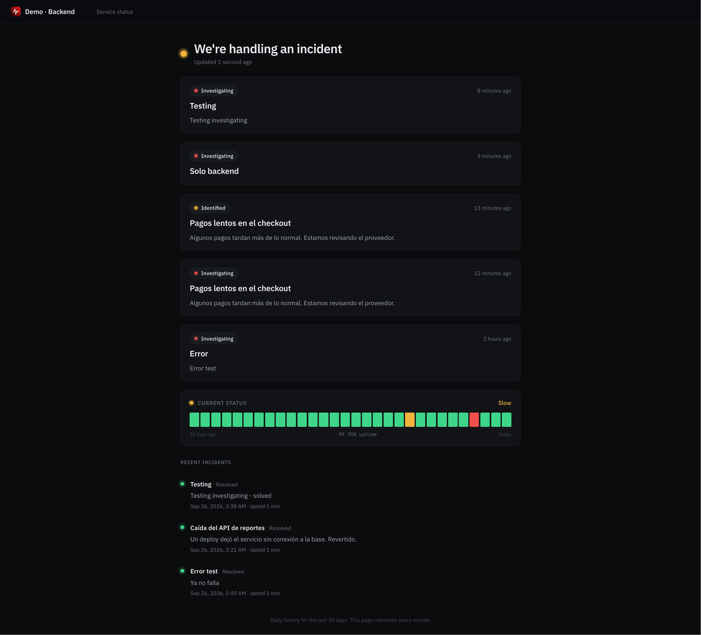
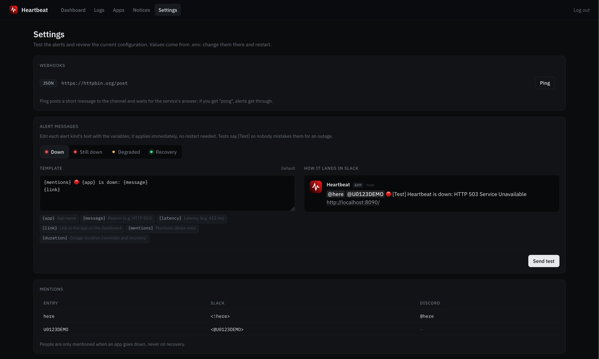

# Heartbeat

**English** | [Español](README_ES.md)

Self-hosted uptime monitor and log viewer for your services. Register each app with a
health URL and a logs URL, and from a single place:

- see whether it's up, slow or down, with its history, latency and SSL certificate;
- get an alert on Slack, Discord or a webhook when it goes down or recovers;
- read its stdout and stderr live;
- publish its status on its own public page (`/status/{slug}`) or on any website with an embeddable
  component.

A single Rust binary, no database: everything is stored in files under `data/`.

## Screenshots

### Dashboard

<details open>
  <summary>Show screenshot</summary>

</details>

### App dashboard

<details>
  <summary>Show screenshot</summary>

</details>

### Logs

<details>
  <summary>Show screenshot</summary>

</details>

### App logs

<details>
  <summary>Show screenshot</summary>

</details>

### Apps

<details>
  <summary>Show screenshot</summary>

</details>

### Notices

<details>
  <summary>Show screenshot</summary>

</details>

### Status app

<details>
  <summary>Show screenshot</summary>

</details>

### Settings

<details>
  <summary>Show screenshot</summary>

</details>

## Features

- **Traffic light per app**, every `UPTIME_INTERVAL_SECS` (60 by default) or on the app's
  own interval:
  - **Up (green)**: answers 2xx, or one of the app's expected status codes (e.g. `401`).
  - **Degraded (yellow)**: answers 2xx but slower than the threshold (the global
    `UPTIME_DEGRADED_MS`, or one set per app), or its certificate expires in fewer than
    `UPTIME_CERT_WARN_DAYS` days. It still counts as available for the uptime %.
  - **Down (red)**: any other status, takes longer than the timeout
    (`UPTIME_TIMEOUT_SECS`, 10 s, or one set per app), can't connect, or the response
    doesn't contain the configured keyword.

  Each app can send its own headers with the check (e.g. a token), and a
  `tcp://host:port` URL checks non-HTTP services (databases, queues) by opening a
  connection, under the same host policy.

  A failure is retried `UPTIME_RETRIES` times (5 s apart) before it's recorded, so a
  dropped packet doesn't paint the app red or send an alert.
- **Alerts** (`ALERT_WEBHOOK_URLS`): only on confirmed status changes (down and recovery;
  degraded is optional with `ALERT_ON_DEGRADED`), naming the app and linking to it. Slack
  and Discord get their native format; any other URL gets a JSON event. `ALERT_MENTIONS`
  pings people when an app goes down: `here`, `channel`, Slack user (`U…`) or user group
  (`S…`) IDs, Discord user IDs or roles (`&…`); see `.env.example`.
  - Each app can add **its own webhooks and mentions** from `/apps`, on top of the global
    ones, and ping them from there.
  - A failed delivery is **retried** (2 s, 10 s, 30 s), and `/settings` shows each
    webhook's latest result.
  - While an app stays down, a **reminder** goes out every `ALERT_REMIND_MINS` (60 by
    default) saying how long it's been down.
  - **Mass outage**: when at least 3 apps and `UPTIME_MASS_DOWN_PCT` (50%) of the
    monitored ones go down at once, Heartbeat's own network is the likely culprit. One
    notice goes out and individual alerts wait; when it's over, only the apps still down
    alert.
- **Settings page** (`/settings`): ping each webhook and see its answer ("pong"),
  edit the text of each alert kind (down, still down, degraded, recovery) with a live
  preview and the variables `{app}`, `{message}`, `{latency}`, `{link}`, `{mentions}` and
  `{duration}`, send a test of
  each, and review the current configuration (secrets shown only as set / not set). Edited
  texts are stored in `ALERT_TEMPLATES_FILE` and apply without a restart; the defaults
  follow `APP_LANG`.
- **Frontends and single-page apps**: the logs URL is optional, so an app can be
  monitor-only. For SPAs (Vue, React…), "Verify JS/CSS bundles" reads the page's
  `<script>`/`<link rel="stylesheet">` references and checks each one really loads as
  JS/CSS. An SPA server answers 200 with the same `index.html` for every path -- often
  even for a missing bundle -- so an incomplete deploy that leaves users a blank page
  would otherwise look up.
- **Pause and maintenance**: a paused app isn't checked, and that time doesn't count
  against its uptime. A pause can last a set time (1 h to 7 days) and end by itself; an
  open-ended pause older than a day is flagged on the dashboard in case it was forgotten.
- **Editing**: everything can change without losing the history or the embed token.
- **Incidents**: each run of failed checks is an incident with its start, duration and
  cause; each app's detail lists the ones in the window, the MTTR and total downtime.
- **Public status page per app** (`/status/{slug}`): only for the apps you publish, with
  no URLs or error messages. It shows the current state, 30 days of daily uptime and the
  **notices** you publish from `/notices` (investigating, identified, monitoring,
  resolved) for that app; a notice naming no app shows on all of them. Resolved ones stay
  7 days as recent incidents. Any other slug answers the same 404.
- **Embed** for other websites, with one token per app, and an **SVG badge** for READMEs
  (see below).
- **Integrations**: `GET /metrics` in the Prometheus format (with `METRICS_TOKEN`) and
  each app's history exported to CSV or JSON from the dashboard.
- **Log viewer** with filters by level, module and text.
- **Dead man's switch** (`HEARTBEAT_PING_URL`): Heartbeat pings that URL after every round
  of checks, so an external service warns you if Heartbeat itself stops. `GET /healthz`
  answers `ok` for load balancers.
- **Spanish or English UI** (`APP_LANG`).

## Authentication

Two modes (`AUTH_MODE`):

- **`upstream`** (default): the login form forwards email and password to `LOGIN_URL`.
  The response must include `access_token` and `is_admin`; that decision belongs to the
  login server, Heartbeat doesn't reimplement it. The token is forwarded as a Bearer token
  to the logs endpoints.
- **`password`**: a local admin, no external server:
  ```bash
  echo 'your-password' | heartbeat hash-password   # prints the argon2 hash
  ```
  and in `.env`: `AUTH_MODE=password`, `ADMIN_EMAIL=...`, `ADMIN_PASSWORD_HASH=<hash>`.

**Read-only**: a viewer sees the dashboard and uptime data, but not logs, apps, notices
or settings, and can't change anything. In `password` mode it's `VIEWER_EMAIL` +
`VIEWER_PASSWORD_HASH`; in `upstream` mode, `UPSTREAM_VIEWERS=true` lets users without
`is_admin` in as viewers.

In both modes the cookie only holds a random session ID; the token stays on the server
(`SESSIONS_FILE`, mode 600), so sessions survive a restart.

## Embed

Each app has an `embed_token`. `/apps` shows a preview and a "Copy code" button:

```html
<script src="https://HEARTBEAT_HOST/static/embed.js" defer></script>
<heartbeat-status app="SLUG" token="EMBED_TOKEN"></heartbeat-status>
```

Optional attributes:
- `label="My API"`: text shown instead of the app's name.
- `theme="light"`: dark by default.
- `lang="en"`: `es` or `en`; defaults to the server's `APP_LANG`.
- `bars="N"`: maximum number of bars; by default as many as fit the width, up to 100.
- `refresh="30"`: seconds between updates.
- Colors: `color-up`, `color-degraded`, `color-down`, `color-empty`, `color-bg`,
  `color-text`, `color-border`, with any CSS color. They can also come from the page's CSS
  (`heartbeat-status { --hb-up: #22c55e; }`); when both are set, the attribute wins.

The component uses Shadow DOM and only talks to `GET /embed/{slug}?token=...` (public,
with CORS), which never returns the health URL or error messages. The token is visible in
the page's HTML: if it leaks, "Rotate token" in `/apps` invalidates every earlier embed.

**Badge**, with the same token, for a README or a wiki:

```markdown

```

The state picks the text and color; the text follows `APP_LANG`:

| App state | Badge |
|---|---|
| Up |  |
| Degraded (slow, or a certificate about to expire) |  |
| Down |  |
| Paused, including scheduled maintenance |  |
| Not checked yet, or no health URL |  |

Parameters:
- `token` (required): the app's embed token. A wrong one answers the same 404 as an
  unknown slug.
- `label` (optional): left-hand text instead of the app's name, up to 40 characters.

It's cached for 60 s and served with open CORS. "Rotate token" in `/apps` also
invalidates the badges already published.

## Metrics

With `METRICS_TOKEN` set, `GET /metrics` exposes each app's state in the Prometheus
format (`heartbeat_up`, `heartbeat_degraded`, `heartbeat_paused`,
`heartbeat_latency_milliseconds`, `heartbeat_uptime_24h_ratio`,
`heartbeat_uptime_30d_ratio`, `heartbeat_cert_expiry_timestamp_seconds`):

```yaml
scrape_configs:
  - job_name: heartbeat
    scheme: https
    authorization: { credentials: METRICS_TOKEN }
    static_configs: [{ targets: ["HEARTBEAT_HOST"] }]
```

## Endpoint contract

What your apps must expose to be registered.

**Health** (`GET`, no authentication): any 2xx counts as up. If you set a keyword, the
body must contain it (up to 256 KB is read).

**Logs** (`GET`, optional -- apps without one are monitor-only): Heartbeat sends:

- `stream=out|error|both` and `lines=N` (query).
- `Authorization: Bearer <admin's access_token>` (`upstream` mode).
- `X-Admin-Logs-Key: <ADMIN_LOGS_KEY>`, when configured.

And expects JSON shaped like this (lines oldest to newest, like `tail -n`):

```json
{
  "out":   { "lines": ["{\"timestamp\":\"...\",\"level\":\"INFO\",\"target\":\"...\",\"fields\":{...}}"], "error": null },
  "error": { "lines": ["raw stderr text"], "error": null }
}
```

- `out.lines`: one JSON line per event, in the
  [`tracing_subscriber::fmt::format::Json`](https://docs.rs/tracing-subscriber/latest/tracing_subscriber/fmt/format/struct.Json.html)
  format.
- `error.lines`: raw text.
- A per-stream `error` (string) means that stream couldn't be read.

The app authorizes the call with the user's JWT or, to read logs across environments,
with the shared key in the `X-Admin-Logs-Key` header (compared in constant time).

## Security

- **Server-side sessions** with 256-bit IDs; a forged cookie grants nothing and "Log out"
  (a POST) truly ends the session.
- **CSRF**: every POST requires an `Origin` (or `Referer`) from the same host.
- **Headers**: CSP (same-origin resources only), `frame-ancestors 'none'` and
  `X-Frame-Options: DENY` (no clickjacking), `nosniff`, `Referrer-Policy`.
- **Login throttling**: 5 failures within 15 minutes lock out that IP and that email.
  Behind a local proxy, the real IP comes from `X-Real-IP` only when the connection comes
  from loopback.
- **Outbound policy** (`src/outbound.rs`): the logs proxy and the checks only call
  `https://` (or `tcp://`) URLs on hosts in `ALLOWED_HOSTS`, never follow redirects, and
  refuse names that resolve to private, loopback or link-local IPs (including the cloud
  metadata address, `169.254.169.254`). Checked when saving and on every request. Each
  app's own webhooks must be `https://` and can't point at private IPs either.
- The logs proxy never echoes back the raw body of non-JSON responses.
- Fonts and every other asset are served by Heartbeat itself.

## Configuration

Every variable, with its default, is in [`.env.example`](.env.example). Only two are
required:

- `ALLOWED_HOSTS`: the hosts registered URLs may point at.
- `LOGIN_URL` in `upstream` mode, or `ADMIN_EMAIL` + `ADMIN_PASSWORD_HASH` in `password`
  mode.

## Running locally

```bash
cp .env.example .env    # edit ALLOWED_HOSTS and authentication; COOKIE_SECURE=false without TLS
cargo run
```

Open `http://localhost:8090`.

With [`just`](https://github.com/casey/just):

- `just demo` (Spanish) or `just demo en` (English): starts with sample data (one app in each state) and a local admin; sign in
  at `http://localhost:8090` as `demo@example.com` / `demo` (admin) or
  `viewer@example.com` / `demo` (read-only). Each app's logs are generated live (the
  `demo` feature, never in a release) to match its state: the down one has errors and
  panics, the steady one mostly INFO. Requires Python 3.
- `just check`: formatting, `cargo deny` (vulnerabilities and licenses), pedantic clippy
  and tests, the same as CI.
- `just e2e`: browser smoke test against a throwaway server (requires Node).

## Deployment

### With Docker

```bash
cp .env.example .env   # edit
docker compose up -d
```

The image runs as an unprivileged user and stores everything in the `./data` volume.
Every release also publishes a multi-arch image (amd64 and arm64):

```bash
docker run -d --env-file .env -p 8090:8090 -v ./data:/app/data ghcr.io/OWNER/heartbeat:latest
```

### On a server (pm2 + nginx)

The binary runs under pm2, with nginx as a reverse proxy and a Let's Encrypt certificate.
The app listens on `8090`; that port is never exposed directly.

First time:

```bash
./prepare_ec2.sh /arena/heartbeat   # installs nginx/certbot/node/pm2/rust and builds
cp .env.example .env                # edit
pm2 start ./target/release/heartbeat --name heartbeat --cwd /arena/heartbeat
pm2 save && pm2 startup
```

nginx and certbot (see `deploy/nginx.conf.example`):

```bash
sudo cp deploy/nginx.conf.example /etc/nginx/sites-available/status.example.com
# edit REPLACE_ME_DOMAIN -> your domain
sudo ln -s /etc/nginx/sites-available/status.example.com /etc/nginx/sites-enabled/
sudo nginx -t && sudo systemctl reload nginx
sudo certbot --nginx -d status.example.com
```

Updating without building on the server: every `v*` tag publishes Linux x86_64 and
aarch64 releases (`.github/workflows/release.yml`), and `deploy/update.sh` installs the
one for the server's architecture. Templates, static files and libs are inside the binary. It never touches
`.env` or `data/`, verifies the checksum, keeps the previous binary and checks `/healthz`:

```bash
HEARTBEAT_REPO=owner/heartbeat deploy/update.sh          # latest release
HEARTBEAT_REPO=owner/heartbeat deploy/update.sh v1.2.0   # a specific one
deploy/update.sh --rollback                               # back to the previous binary
```

## Limits

The whole history lives in memory and in one JSONL file per app, compacted hourly. At one
check a minute and 30 days of retention that's about 43,000 records per app: fine up to
roughly 100 apps. Beyond that, raise the interval, lower the retention, or move storage
to SQLite.

Every check runs from a single machine: mass-outage detection prevents an alert storm
when its network fails, but it's no substitute for probes from several regions.

## License

[Elastic License 2.0](LICENSE) (ELv2). You can use, copy, modify and redistribute
Heartbeat, including inside your company and for your own clients' services, but you
may not offer it to third parties as a hosted or managed service (a SaaS built on it).
It's source-available, not an OSI open-source license.

## Stack

- `actix-web` (HTTP server) and `tera` (server-side templates), with templates, static
  files and libs embedded in the binary (`rust-embed`; debug builds read them from disk).
- Alpine.js vendored in `libs/alpinejs/`: interactivity without a build step.
- IBM Plex served locally (`static/fonts`, OFL license).
- UI strings in `locales/<lang>.json` (server) and `static/i18n/<lang>.js` (client).
