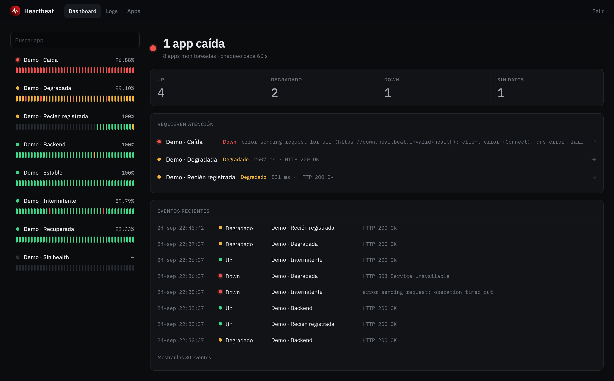
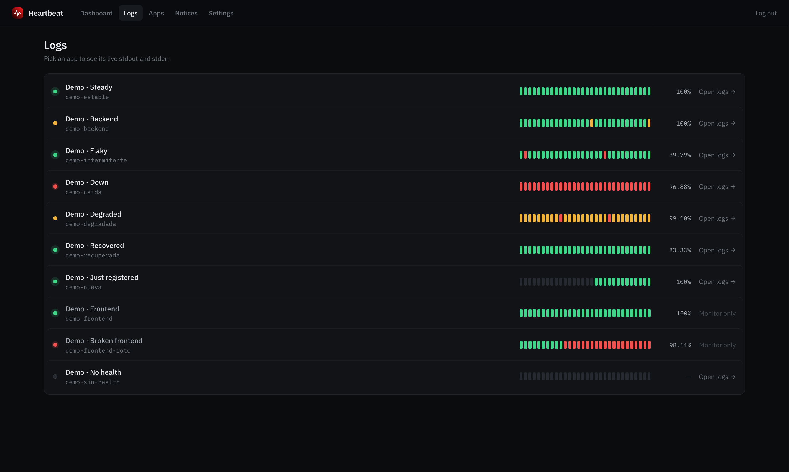
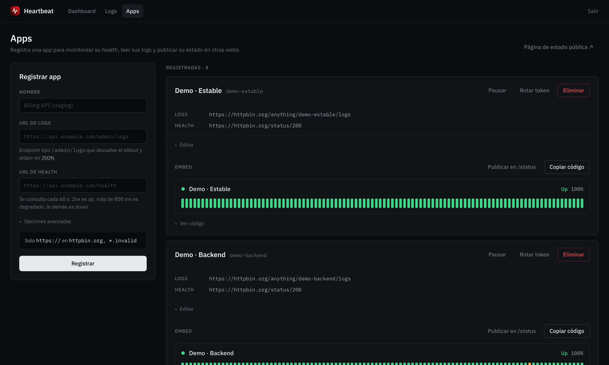
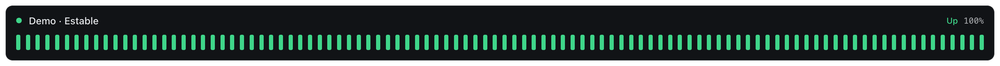

# Heartbeat

**English** | [Español](README_ES.md)

Self-hosted uptime monitor and log viewer for your services. Register each app with a
health URL and a logs URL, and from a single place:

- see whether it's up, slow or down, with its history, latency and SSL certificate;
- get an alert on Slack, Discord or a webhook when it goes down or recovers;
- read its stdout and stderr live;
- publish its status on a public page (`/status`) or on any website with an embeddable
  component.

A single Rust binary, no database: everything is stored in files under `data/`.

## Screenshots

### Dashboard

<details open>
  <summary>Show screenshot</summary>

</details>

### Logs

<details>
  <summary>Show screenshot</summary>

</details>

### Apps

<details>
  <summary>Show screenshot</summary>

</details>

### Embed

<details>
  <summary>Show screenshot</summary>

</details>

## Features

- **Traffic light per app**, every `UPTIME_INTERVAL_SECS` (60 by default):
  - **Up (green)**: answers 2xx.
  - **Degraded (yellow)**: answers 2xx but slower than the threshold (the global
    `UPTIME_DEGRADED_MS`, or one set per app), or its certificate expires in fewer than
    `UPTIME_CERT_WARN_DAYS` days. It still counts as available for the uptime %.
  - **Down (red)**: any other status, takes longer than 10 s, can't connect, or the
    response doesn't contain the configured keyword.

  A failure is retried `UPTIME_RETRIES` times (5 s apart) before it's recorded, so a
  dropped packet doesn't paint the app red or send an alert.
- **Alerts** (`ALERT_WEBHOOK_URLS`): only on confirmed status changes (down and recovery;
  degraded is optional with `ALERT_ON_DEGRADED`). Slack and Discord get their native
  format; any other URL gets a JSON event.
- **Pause and maintenance**: a paused app isn't checked, and that time doesn't count
  against its uptime.
- **Editing**: name, URLs, threshold and keyword can change without losing the history or
  the embed token.
- **Public status page** (`/status`): only the apps you mark as public, with no URLs or
  error messages.
- **Embed** for other websites, with one token per app (see below).
- **Log viewer** with filters by level, module and text.
- **Dead man's switch** (`HEARTBEAT_PING_URL`): Heartbeat pings that URL after every round
  of checks, so an external service warns you if Heartbeat itself stops. `GET /healthz`
  answers `ok` for load balancers.
- **Spanish or English UI** (`APP_LANG`).

## Authentication

Two modes (`AUTH_MODE`):

- **`upstream`** (default): the login form forwards email and password to `LOGIN_URL`.
  The response must include `access_token` and `is_admin`; that decision belongs to the
  login server, Heartbeat doesn't reimplement it. The token is forwarded as a Bearer token
  to the logs endpoints.
- **`password`**: a single local admin, no external server:
  ```bash
  echo 'your-password' | heartbeat hash-password   # prints the argon2 hash
  ```
  and in `.env`: `AUTH_MODE=password`, `ADMIN_EMAIL=...`, `ADMIN_PASSWORD_HASH=<hash>`.

In both modes the cookie only holds a random session ID; the token stays on the server
(`SESSIONS_FILE`, mode 600), so sessions survive a restart.

## Embed

Each app has an `embed_token`. `/apps` shows a preview and a "Copy code" button:

```html
<script src="https://HEARTBEAT_HOST/static/embed.js" defer></script>
<heartbeat-status app="SLUG" token="EMBED_TOKEN"></heartbeat-status>
```

Optional attributes:
- `label="My API"`: text shown instead of the app's name.
- `theme="light"`: dark by default.
- `lang="en"`: `es` or `en`; defaults to the server's `APP_LANG`.
- `bars="N"`: maximum number of bars; by default as many as fit the width, up to 100.
- `refresh="30"`: seconds between updates.
- Colors: `color-up`, `color-degraded`, `color-down`, `color-empty`, `color-bg`,
  `color-text`, `color-border`, with any CSS color. They can also come from the page's CSS
  (`heartbeat-status { --hb-up: #22c55e; }`); when both are set, the attribute wins.

The component uses Shadow DOM and only talks to `GET /embed/{slug}?token=...` (public,
with CORS), which never returns the health URL or error messages. The token is visible in
the page's HTML: if it leaks, "Rotate token" in `/apps` invalidates every earlier embed.

## Endpoint contract

What your apps must expose to be registered.

**Health** (`GET`, no authentication): any 2xx counts as up. If you set a keyword, the
body must contain it (up to 256 KB is read).

**Logs** (`GET`): Heartbeat sends:

- `stream=out|error|both` and `lines=N` (query).
- `Authorization: Bearer <admin's access_token>` (`upstream` mode).
- `X-Admin-Logs-Key: <ADMIN_LOGS_KEY>`, when configured.

And expects JSON shaped like this (lines oldest to newest, like `tail -n`):

```json
{
  "out":   { "lines": ["{\"timestamp\":\"...\",\"level\":\"INFO\",\"target\":\"...\",\"fields\":{...}}"], "error": null },
  "error": { "lines": ["raw stderr text"], "error": null }
}
```

- `out.lines`: one JSON line per event, in the
  [`tracing_subscriber::fmt::format::Json`](https://docs.rs/tracing-subscriber/latest/tracing_subscriber/fmt/format/struct.Json.html)
  format.
- `error.lines`: raw text.
- A per-stream `error` (string) means that stream couldn't be read.

The app authorizes the call with the user's JWT or, to read logs across environments,
with the shared key in the `X-Admin-Logs-Key` header (compared in constant time).

## Security

- **Server-side sessions** with 256-bit IDs; a forged cookie grants nothing and "Log out"
  (a POST) truly ends the session.
- **CSRF**: every POST requires an `Origin` (or `Referer`) from the same host.
- **Headers**: CSP (same-origin resources only), `frame-ancestors 'none'` and
  `X-Frame-Options: DENY` (no clickjacking), `nosniff`, `Referrer-Policy`.
- **Login throttling**: 5 failures within 15 minutes lock out that IP and that email.
  Behind a local proxy, the real IP comes from `X-Real-IP` only when the connection comes
  from loopback.
- **Outbound policy** (`src/outbound.rs`): the logs proxy and the checks only call
  `https://` URLs on hosts in `ALLOWED_HOSTS`, never follow redirects, and refuse names
  that resolve to private, loopback or link-local IPs (including the cloud metadata
  address, `169.254.169.254`). Checked when saving and on every request.
- The logs proxy never echoes back the raw body of non-JSON responses.
- Fonts and every other asset are served by Heartbeat itself.

## Configuration

Every variable, with its default, is in [`.env.example`](.env.example). Only two are
required:

- `ALLOWED_HOSTS`: the hosts registered URLs may point at.
- `LOGIN_URL` in `upstream` mode, or `ADMIN_EMAIL` + `ADMIN_PASSWORD_HASH` in `password`
  mode.

## Running locally

```bash
cp .env.example .env    # edit ALLOWED_HOSTS and authentication; COOKIE_SECURE=false without TLS
cargo run
```

Open `http://localhost:8090`.

With [`just`](https://github.com/casey/just):

- `just demo`: starts with sample data (one app in each state) and a local admin; sign in
  at `http://localhost:8090` as `demo@example.com` / `demo`. Requires Python 3.
- `just check`: formatting, pedantic clippy and tests, the same as CI.
- `just e2e`: browser smoke test against a throwaway server (requires Node).

## Deployment

### With Docker

```bash
cp .env.example .env   # edit
docker compose up -d
```

The image runs as an unprivileged user and stores everything in the `./data` volume.

### On a server (pm2 + nginx)

The binary runs under pm2, with nginx as a reverse proxy and a Let's Encrypt certificate.
The app listens on `8090`; that port is never exposed directly.

First time:

```bash
./prepare_ec2.sh /arena/heartbeat   # installs nginx/certbot/node/pm2/rust and builds
cp .env.example .env                # edit
pm2 start ./target/release/heartbeat --name heartbeat --cwd /arena/heartbeat
pm2 save && pm2 startup
```

nginx and certbot (see `deploy/nginx.conf.example`):

```bash
sudo cp deploy/nginx.conf.example /etc/nginx/sites-available/status.example.com
# edit REPLACE_ME_DOMAIN -> your domain
sudo ln -s /etc/nginx/sites-available/status.example.com /etc/nginx/sites-enabled/
sudo nginx -t && sudo systemctl reload nginx
sudo certbot --nginx -d status.example.com
```

Updating without building on the server: every `v*` tag publishes a Linux x86_64 release
(`.github/workflows/release.yml`), and `deploy/update.sh` installs it. It never touches
`.env` or `data/`, verifies the checksum, keeps the previous binary and checks `/healthz`:

```bash
HEARTBEAT_REPO=owner/heartbeat deploy/update.sh          # latest release
HEARTBEAT_REPO=owner/heartbeat deploy/update.sh v1.2.0   # a specific one
deploy/update.sh --rollback                               # back to the previous binary
```

## Stack

- `actix-web` (HTTP server) and `tera` (server-side templates).
- Alpine.js vendored in `libs/alpinejs/`: interactivity without a build step.
- IBM Plex served locally (`static/fonts`, OFL license).
- UI strings in `locales/<lang>.json` (server) and `static/i18n/<lang>.js` (client).
