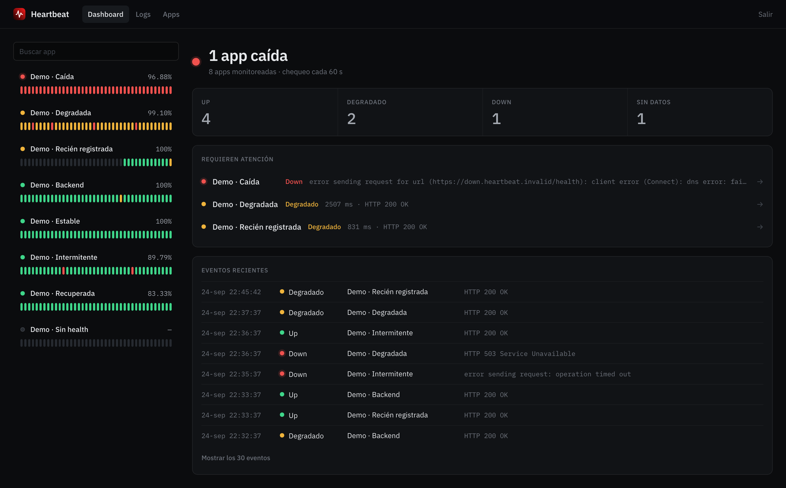
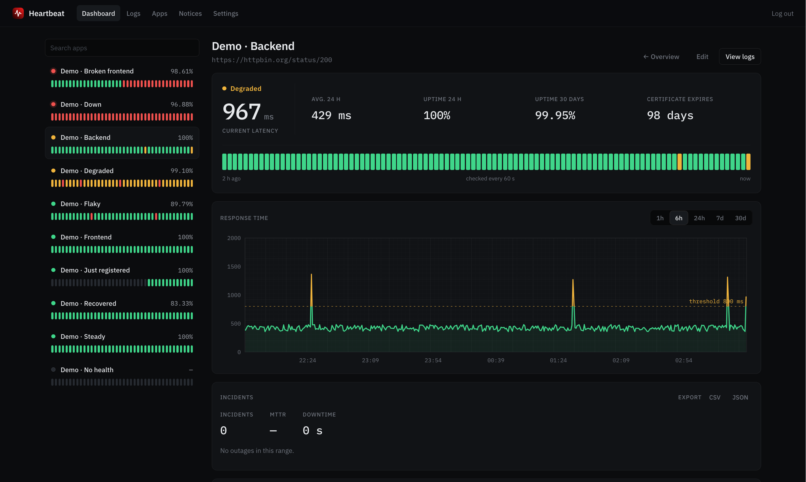
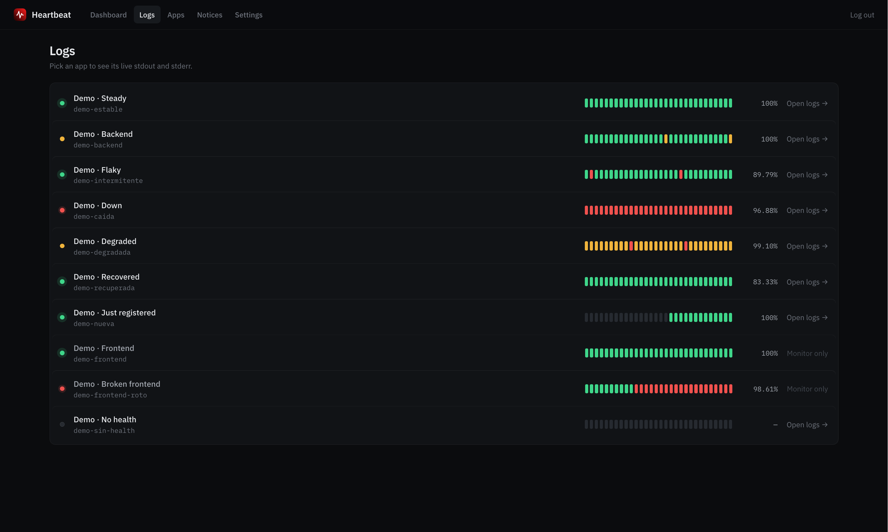
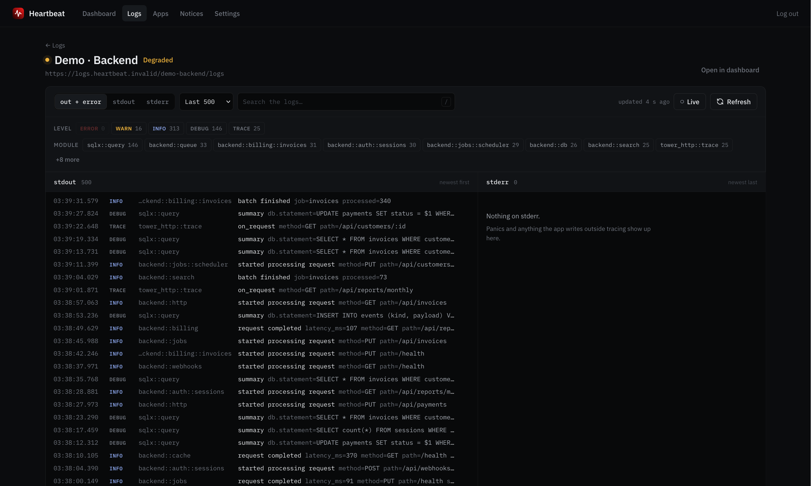
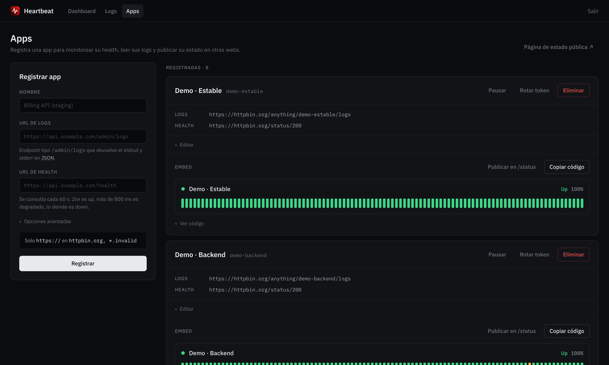
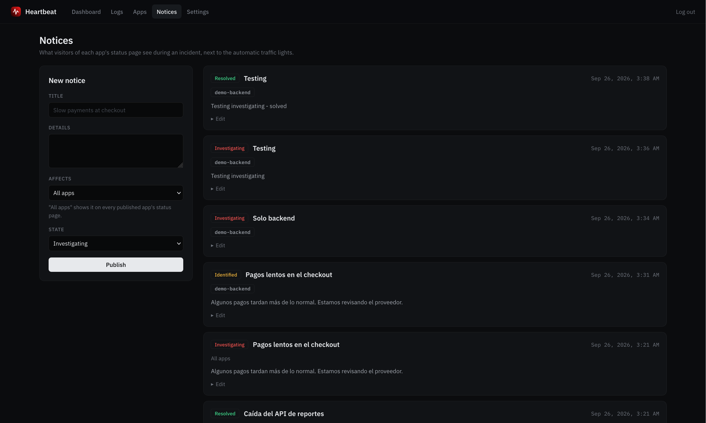
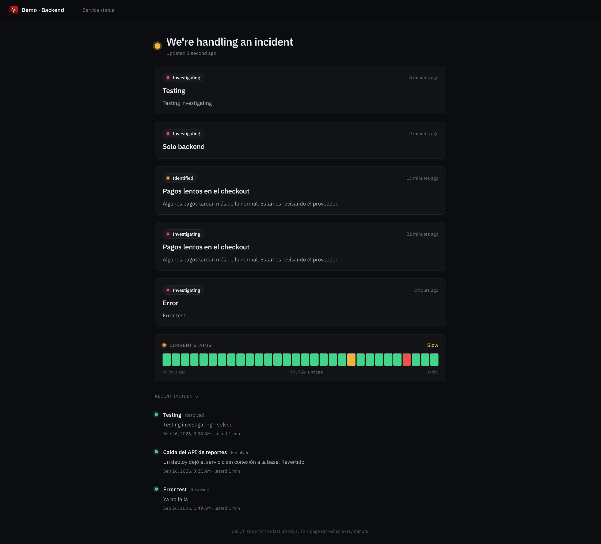
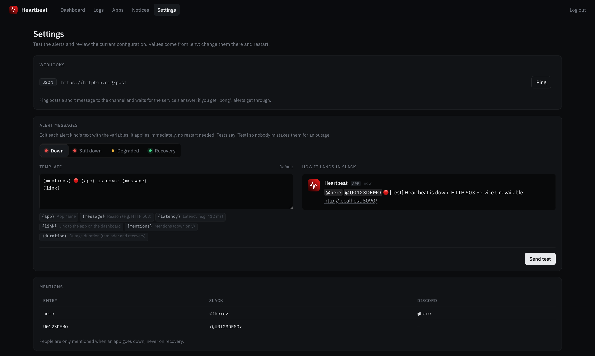

# Heartbeat

[English](README.md) | **Español**

Monitor de uptime y visor de logs para tus servicios, autohospedado. Registras cada app
con una URL de health y una de logs, y desde un solo lugar:

- ves si está arriba, lenta o caída, con su historial, latencia y certificado SSL;
- recibes una alerta en Slack, Discord o un webhook cuando se cae o se recupera;
- lees su stdout y stderr en vivo;
- publicas su estado en su propia página pública (`/status/{slug}`) o en cualquier web con un
  componente embebible.

Un solo binario de Rust con SQLite integrado: todo se guarda en un archivo,
`data/heartbeat.db`, sin un servidor de base de datos que mantener.

## Capturas

### Dashboard

<details open>
  <summary>Ver captura</summary>

</details>

### Dashboard de una app

<details>
  <summary>Ver captura</summary>

</details>

### Logs

<details>
  <summary>Ver captura</summary>

</details>

### Logs de una app

<details>
  <summary>Ver captura</summary>

</details>

### Apps

<details>
  <summary>Ver captura</summary>

</details>

### Avisos

<details>
  <summary>Ver captura</summary>

</details>

### Página de estado de una app

<details>
  <summary>Ver captura</summary>

</details>

### Configuración

<details>
  <summary>Ver captura</summary>

</details>

## Funciones

- **Semáforo por app**, cada `UPTIME_INTERVAL_SECS` (60 por defecto) o con el intervalo
  propio de la app:
  - **Up (verde)**: responde 2xx, o uno de los códigos esperados de la app (p. ej. `401`).
  - **Degradado (amarillo)**: responde 2xx pero tarda más que el umbral (global
    `UPTIME_DEGRADED_MS`, o uno propio por app), o su certificado vence en menos de
    `UPTIME_CERT_WARN_DAYS` días. Cuenta como disponible para el % de uptime.
  - **Down (rojo)**: responde con otro status, tarda más que el timeout
    (`UPTIME_TIMEOUT_SECS`, 10 s, o uno propio por app), no conecta, o la respuesta no
    contiene la palabra clave configurada.

  Cada app puede mandar headers propios en el chequeo (p. ej. un token), y una URL
  `tcp://host:puerto` chequea servicios que no son HTTP (bases de datos, colas) abriendo
  una conexión, con la misma política de hosts.

  Una caída se reintenta `UPTIME_RETRIES` veces (5 s entre intentos) antes de marcarse,
  así que un paquete perdido no pinta la app de rojo ni manda una alerta.

- **Comandos de chat**: `/pulse status`, `pause` y `resume` desde Slack y Discord; ver
  [Comandos de chat](#comandos-de-chat).
- **Alertas** (`ALERT_WEBHOOK_URLS`): solo en cambios de estado confirmados (caída y
  recuperación; degradado es opcional con `ALERT_ON_DEGRADED`), con el nombre de la app y
  un link a ella. Slack y Discord reciben su formato nativo; cualquier otra URL recibe un
  JSON con el evento. `ALERT_MENTIONS` etiqueta a personas cuando una app se cae: `here`,
  `channel`, IDs de usuario (`U…`) o grupo (`S…`) de Slack, usuarios o roles (`&…`) de
  Discord; ver `.env.example`.
  - Cada app puede agregar **sus propios webhooks y menciones** desde `/apps`, además de los
    globales, y probarlos desde ahí.
  - Un envío fallido se **reintenta** (2 s, 10 s, 30 s) y `/settings` muestra el último
    resultado de cada webhook.
  - Mientras una app siga caída, llega un **recordatorio** cada `ALERT_REMIND_MINS` (60
    por defecto) con cuánto tiempo lleva caída.
  - **Caída masiva**: si caen a la vez al menos 3 apps y el `UPTIME_MASS_DOWN_PCT` (50 %)
    de las monitoreadas, lo más probable es que falle la red de Heartbeat, no las apps.
    Llega un solo aviso y las alertas individuales esperan; al terminar, solo avisan las
    apps que siguen caídas.
- **Página de configuración** (`/settings`): haz ping a cada webhook y ve su respuesta
  ("pong"), edita el texto de cada tipo de alerta (caída, sigue caída, degradada,
  recuperación) con vista previa en vivo y las variables `{app}`, `{message}`,
  `{latency}`, `{link}`, `{mentions}` y `{duration}`, envía una prueba de cada una y consulta la configuración actual (los
  secretos solo aparecen como configurados o no). Los textos editados se guardan en
  la base de datos y aplican sin reiniciar; los de por defecto siguen `APP_LANG`.
- **Frontends y SPAs**: la URL de logs es opcional, así que una app puede ser solo de
  monitoreo. Para SPAs (Vue, React…), "Verificar bundles JS/CSS" lee las referencias
  `<script>`/`<link rel="stylesheet">` de la página y confirma que cada una cargue como
  JS/CSS de verdad. El servidor de una SPA responde 200 con el mismo `index.html` en
  todas las rutas (muchas veces incluso para un bundle que no existe), así que un deploy
  incompleto que deja la página en blanco se vería como arriba.
- **Pausa y mantenimiento**: una app pausada no se consulta, y ese tiempo no cuenta para
  su uptime. La pausa puede durar un tiempo fijo (1 h a 7 días) y termina sola; una pausa
  sin fin de más de un día se marca en el dashboard, por si se olvidó.
- **Edición**: todo se cambia sin perder el historial ni el token del embed.
- **Incidentes**: cada racha de chequeos caídos es un incidente con inicio, duración y
  causa; el detalle de cada app muestra los de la ventana, el MTTR y el tiempo total caído.
- **Página de estado pública por app** (`/status/{slug}`): solo para las apps que
  publiques, sin URLs ni mensajes de error. Muestra el estado actual, 90 días de uptime
  diario y los **avisos** que publiques desde `/notices` (investigando, identificado,
  monitoreando, resuelto) para esa app; un aviso sin apps elegidas aparece en todas. Los
  resueltos quedan 7 días como incidentes recientes. Cualquier otro slug responde el
  mismo 404.
- **Embed** para otras webs, con un token por app, y **badge SVG** para READMEs (ver
  abajo).
- **Integraciones**: `GET /metrics` en formato Prometheus (con `METRICS_TOKEN`) y
  exportación del historial de cada app a CSV o JSON desde el dashboard.
- **Sistema**: CPU, memoria, disco y los procesos que más consumen del servidor de
  Heartbeat y del de cada app, con historial y alertas; ver "Sistema" más abajo.
- **Visor de logs** con filtros por nivel, módulo y texto.
- **Registro de auditoría** (`/audit`): inicios de sesión, cada cambio, lecturas de logs y
  comandos de chat, con quién y cuándo; ver "Registro de auditoría" más abajo.
- **Dead man's switch** (`HEARTBEAT_PING_URL`): Heartbeat hace ping a esa URL después de
  cada ronda, para que un servicio externo te avise si Heartbeat mismo se detiene.
  `GET /healthz` responde `ok` para balanceadores.
- **Interfaz en español o inglés** (`APP_LANG`).
- **Tema del sistema, oscuro, claro o personalizado**, que cada navegador elige en la
  barra superior; «Sistema» (el de por defecto) sigue el modo claro u oscuro del sistema
  operativo.
  El personalizado es CSS que un admin guarda en `/settings` (normalmente solo cambia
  las variables de color de `static/tokens.css`), y se guarda en la base de datos.

## Autenticación

Dos modos (`AUTH_MODE`):

- **`upstream`** (por defecto): el login reenvía email y password a `LOGIN_URL`. La
  respuesta debe traer `access_token` e `is_admin`; esa decisión es del servidor de login,
  Heartbeat no la reimplementa. El token se reenvía como Bearer a los endpoints de logs.
- **`password`**: un admin local, sin servidor externo:
  ```bash
  echo 'tu-password' | heartbeat hash-password   # imprime el hash argon2
  ```
  y en `.env`: `AUTH_MODE=password`, `ADMIN_EMAIL=...`, `ADMIN_PASSWORD_HASH=<hash>`.

**Solo lectura**: un viewer ve el dashboard y los datos de uptime, pero no logs, apps,
avisos ni configuración, y no puede cambiar nada. En modo `password` se define con
`VIEWER_EMAIL` + `VIEWER_PASSWORD_HASH`; en modo `upstream`, `UPSTREAM_VIEWERS=true` deja
entrar como viewers a los usuarios sin `is_admin`.

En los dos modos, la cookie solo lleva un ID de sesión aleatorio; el token queda en el
servidor (en la base de datos, cuyo archivo tiene permisos 600), así que las sesiones
sobreviven a un reinicio.

## Embed

Cada app tiene un `embed_token`. En `/apps` está la vista previa y el botón "Copiar
código":

```html
<script src="https://HEARTBEAT_HOST/static/embed.js" defer></script>
<heartbeat-status app="SLUG" token="EMBED_TOKEN"></heartbeat-status>
```

Atributos opcionales:

- `label="Mi API"`: texto en lugar del nombre de la app.
- `theme="light"`: el tema por defecto es oscuro.
- `lang="en"`: `es` o `en`; por defecto, el `APP_LANG` del servidor.
- `bars="N"`: máximo de barras; por defecto las que quepan en el ancho, hasta 100.
- `refresh="30"`: segundos entre actualizaciones.
- Colores: `color-up`, `color-degraded`, `color-down`, `color-empty`, `color-bg`,
  `color-text`, `color-border`, con cualquier color CSS. También desde el CSS de la página
  (`heartbeat-status { --hb-up: #22c55e; }`); si hay ambos, gana el atributo.

El componente usa Shadow DOM y solo habla con `GET /embed/{slug}?token=...` (público, con
CORS), que nunca devuelve la URL de health ni los mensajes de error. El token queda
visible en el HTML de la página: si se filtra, "Rotar token" en `/apps` invalida todos los
embeds anteriores.

**Badge**, con el mismo token, para un README o una wiki:

```markdown

```

El estado elige el texto y el color; el texto sigue `APP_LANG`:

| Estado de la app | Badge |
|---|---|
| Up |  |
| Degradado (lento o con el certificado por vencer) |  |
| Down |  |
| Pausada, incluido el mantenimiento programado |  |
| Sin chequeos todavía, o sin URL de health |  |

Parámetros:

- `token` (obligatorio): el token del embed de la app. Uno incorrecto responde el mismo
  404 que un slug que no existe.
- `label` (opcional): texto de la izquierda en lugar del nombre de la app, hasta 40
  caracteres.

Se cachea 60 s y responde con CORS abierto. "Rotar token" en `/apps` también invalida los
badges ya publicados.

## Métricas

Con `METRICS_TOKEN` configurado, `GET /metrics` expone el estado de cada app en formato
Prometheus (`heartbeat_up`, `heartbeat_degraded`, `heartbeat_paused`,
`heartbeat_latency_milliseconds`, `heartbeat_uptime_24h_ratio`,
`heartbeat_uptime_30d_ratio`, `heartbeat_cert_expiry_timestamp_seconds`):

```yaml
scrape_configs:
  - job_name: heartbeat
    scheme: https
    authorization: { credentials: METRICS_TOKEN }
    static_configs: [{ targets: ["HEARTBEAT_HOST"] }]
```

## Comandos de chat

`/pulse` responde desde Slack y Discord, en el canal donde se escribe:

| Comando | Qué hace | Quién |
|---|---|---|
| `/pulse status` | Todas las apps, las peores primero, con latencia y uptime de 24 h | Cualquiera |
| `/pulse status <app>` | Una app: estado, error, latencia, uptime, pausa, certificado | Cualquiera |
| `/pulse pause <app> [30m\|2h\|1d]` | Pausa sus chequeos (sin duración: hasta reanudarla) | `CHAT_ADMINS` |
| `/pulse resume <app>` | Reanuda sus chequeos | `CHAT_ADMINS` |
| `/pulse help` | Cómo usarlo, solo para ti | Cualquiera |

`<app>` es el slug, el nombre o parte de ellos; Discord lo autocompleta. Cada instalación
crea sus propias apps de Slack y Discord, así que ninguna solicitud pasa por terceros.
Ambos servicios deben poder llegar a `PUBLIC_URL` por https.

**Slack**

1. `/settings` → *Comandos de chat* muestra un manifest que apunta a tu `PUBLIC_URL`.
2. [api.slack.com/apps](https://api.slack.com/apps) → *Create New App* → *From a
   manifest* → pégalo → *Install to Workspace*.
3. Copia *Basic Information* → *Signing Secret* a `SLACK_SIGNING_SECRET` y reinicia.

**Discord**

1. [discord.com/developers](https://discord.com/developers/applications) → *New
   Application*. Copia el *Application ID* y la *Public Key* a `DISCORD_APPLICATION_ID` y
   `DISCORD_PUBLIC_KEY`, y *Bot* → *Reset Token* a `DISCORD_BOT_TOKEN`.
2. Reinicia Heartbeat: registra el comando cada vez que arranca.
3. Pega `https://<PUBLIC_URL>/discord/interactions` como *Interactions Endpoint URL*
   (Discord la verifica en ese momento, así que Heartbeat debe estar corriendo).
4. Abre el link de invitación de `/settings` y elige el servidor.

`CHAT_ADMINS` define quién puede pausar y reanudar: IDs de usuario de Slack (`U…`), IDs de
usuario de Discord y roles de Discord (`&…`), como en `ALERT_MENTIONS`. El nombre del
comando es `CHAT_COMMAND`.

## Registro de auditoría

`/audit` (solo administradores) lista quién hizo qué, lo más reciente primero, y lo
exporta como CSV:

- **Sesiones**: inicios de sesión (exitosos, fallidos, bloqueados) y cierres, con el email
  y la IP.
- **Apps**: altas (con su configuración), ediciones (solo los campos que cambiaron, antes y
  después), borrados, pausas y reanudaciones, publicación, rotación del token del embed y
  pruebas de alertas.
- **Chat**: todos los comandos de Slack y Discord, incluidos los rechazados por no estar
  en `CHAT_ADMINS`, con el canal y lo que se escribió.
- **Lecturas**: los logs de una app (una vez por persona y app cada 15 minutos, porque el
  visor hace polling) y las exportaciones de uptime.
- **Configuración**: el tema (con su CSS), las plantillas de alertas, las pruebas de
  alertas y los avisos.
- **Heartbeat mismo**: el fin de una pausa programada.

Se guarda en la tabla `audit_log`, se filtra por quién, acción, app, origen, resultado y
fecha, y se conserva `AUDIT_RETENTION_DAYS` días (365; 0 = para siempre). Nunca se
registran contraseñas ni tokens, los headers del chequeo aparecen solo por nombre y las
URLs de webhooks van enmascaradas. Las sesiones iniciadas antes de 0.3.1 no tienen email:
sus acciones aparecen así hasta el siguiente inicio de sesión.

## Sistema

Heartbeat muestra la CPU, la memoria y el disco de su propio servidor en el dashboard, y los
del servidor de cada app en su detalle (al hacer clic en la app), con una gráfica de 1 h a
7 días, los procesos que más consumen (como `top`) y alertas. `/pulse status <app>` agrega
una línea con las últimas cifras.

- **El servidor de Heartbeat** se lee directamente (sin configurar nada).
- **Cada app** tiene una **URL de sistema** opcional en `/apps`, que Heartbeat consulta cada
  `SYSTEM_INTERVAL_SECS` (30) con `X-Admin-Logs-Key: <ADMIN_LOGS_KEY>`, con la misma política
  de hosts que la URL de logs. Las muestras se guardan `SYSTEM_RETENTION_DAYS` días (7).
- **Alertas** a los webhooks globales (y a los propios de la app) cuando el disco más lleno
  llega a `SYSTEM_ALERT_DISK_PCT` (90), o la memoria o la CPU pasan de
  `SYSTEM_ALERT_MEMORY_PCT` / `SYSTEM_ALERT_CPU_PCT` (90) durante `SYSTEM_ALERT_SUSTAIN_MINS`
  minutos (5); un aviso cuando vuelven a bajar, 5 puntos por debajo. 0 desactiva una. Una app
  pausada no alerta.

La URL de sistema responde un JSON como este (`cpu.usage_pct`, `memory.total_bytes` y
`memory.used_bytes` son obligatorios; el resto es opcional):

```json
{
  "cpu": { "usage_pct": 23.5, "cores": 2, "load": [0.4, 0.3, 0.2] },
  "memory": { "total_bytes": 952107008, "used_bytes": 404750336, "available_bytes": 546308096 },
  "swap": { "total_bytes": 0, "used_bytes": 0 },
  "disks": [{ "mount": "/", "total_bytes": 25769803776, "used_bytes": 9126805504 }],
  "processes": [{ "pid": 1234, "name": "api", "cpu_pct": 12.1, "memory_bytes": 81264640 }],
  "uptime_secs": 864000
}
```

Heartbeat guarda hasta 16 discos y 20 procesos, y lee como máximo 256 KB. Un handler para
una app con axum, usando [`sysinfo`](https://crates.io/crates/sysinfo):

<details>
  <summary>Ver el código</summary>

```rust
// GET /admin/system for Heartbeat: CPU, memory, disks and the busiest processes.
// Cargo.toml: sysinfo = { version = "0.39", default-features = false, features = ["system", "disk"] }
use std::sync::{Arc, Mutex};

use axum::{Json, extract::State, http::{HeaderMap, StatusCode}};
use serde_json::{Value, json};
use sysinfo::{Disks, ProcessRefreshKind, ProcessesToUpdate, System};

/// Kept between calls: CPU usage is measured since the previous one.
#[derive(Clone, Default)]
pub struct SystemState(Arc<Mutex<System>>);

pub async fn system(State(state): State<SystemState>, headers: HeaderMap) -> Result<Json<Value>, StatusCode> {
    // The same key as /admin/logs. Compare it in constant time in production.
    let key = std::env::var("ADMIN_LOGS_KEY").map_err(|_| StatusCode::NOT_FOUND)?;
    if headers.get("x-admin-logs-key").and_then(|v| v.to_str().ok()) != Some(key.as_str()) {
        return Err(StatusCode::UNAUTHORIZED);
    }
    let body = tokio::task::spawn_blocking(move || {
        let mut sys = state.0.lock().unwrap();
        sys.refresh_cpu_usage();
        sys.refresh_memory();
        let kind = ProcessRefreshKind::nothing().with_cpu().with_memory();
        sys.refresh_processes_specifics(ProcessesToUpdate::All, true, kind);
        let mut processes: Vec<_> = sys.processes().values().collect();
        processes.sort_by(|a, b| b.cpu_usage().total_cmp(&a.cpu_usage()));
        let load = System::load_average();
        let disks: Vec<Value> = Disks::new_with_refreshed_list()
            .list()
            .iter()
            .filter(|d| d.mount_point() == std::path::Path::new("/"))
            .map(|d| json!({
                "mount": d.mount_point(),
                "total_bytes": d.total_space(),
                "used_bytes": d.total_space() - d.available_space(),
            }))
            .collect();
        json!({
            "cpu": { "usage_pct": sys.global_cpu_usage(), "cores": sys.cpus().len(),
                     "load": [load.one, load.five, load.fifteen] },
            "memory": { "total_bytes": sys.total_memory(), "used_bytes": sys.used_memory(),
                        "available_bytes": sys.available_memory() },
            "swap": { "total_bytes": sys.total_swap(), "used_bytes": sys.used_swap() },
            "disks": disks,
            "processes": processes.iter().take(20).map(|p| json!({
                "pid": p.pid().as_u32(), "name": p.name().to_string_lossy(),
                "cpu_pct": p.cpu_usage(), "memory_bytes": p.memory(),
            })).collect::<Vec<_>>(),
            "uptime_secs": System::uptime(),
        })
    })
    .await
    .map_err(|_| StatusCode::INTERNAL_SERVER_ERROR)?;
    Ok(Json(body))
}
```

Se monta con `.route("/admin/system", get(system::system)).with_state(SystemState::default())`.
El uso de CPU se mide entre dos llamadas, así que la primera lee cerca de 0.

</details>

## Contrato de los endpoints

Lo que tus apps deben exponer para registrarse.

**Health** (`GET`, sin autenticación): cualquier 2xx cuenta como arriba. Si configuras una
palabra clave, el cuerpo debe contenerla (se leen hasta 256 KB).

**Logs** (`GET`, opcional: las apps sin él son solo de monitoreo): Heartbeat manda:

- `stream=out|error|both` y `lines=N` (query).
- `Authorization: Bearer <access_token del admin>` (modo `upstream`).
- `X-Admin-Logs-Key: <ADMIN_LOGS_KEY>`, si está configurada.

Y espera JSON con esta forma (líneas de la más vieja a la más nueva, como `tail -n`):

```json
{
  "out":   { "lines": ["{\"timestamp\":\"...\",\"level\":\"INFO\",\"target\":\"...\",\"fields\":{...}}"], "error": null },
  "error": { "lines": ["texto crudo de stderr"], "error": null }
}
```

- `out.lines`: una línea JSON por evento, en el formato de
  [`tracing_subscriber::fmt::format::Json`](https://docs.rs/tracing-subscriber/latest/tracing_subscriber/fmt/format/struct.Json.html).
- `error.lines`: texto crudo.
- Un `error` por stream (string) indica que ese stream no se pudo leer.

La app autoriza la llamada con el JWT del usuario o, para ver logs entre ambientes, con la
clave compartida del header `X-Admin-Logs-Key` (comparada en tiempo constante).

## Seguridad

- **Sesiones del lado del servidor** con IDs de 256 bits; una cookie inventada no da
  acceso y "Salir" (un POST) invalida la sesión de verdad.
- **CSRF**: todo POST exige un `Origin` (o `Referer`) del mismo host, salvo
  `/slack/commands` y `/discord/interactions`, que no leen la sesión y solo aceptan
  solicitudes firmadas por Slack (HMAC-SHA256) o Discord (Ed25519) en los últimos 5 minutos.
- **Headers**: CSP (solo recursos del propio origen), `frame-ancestors 'none'` y
  `X-Frame-Options: DENY` (sin clickjacking), `nosniff`, `Referrer-Policy`.
- **Límite de intentos de login**: 5 fallos en 15 minutos bloquean esa IP y ese email.
  Detrás de un proxy local, la IP real se toma de `X-Real-IP` solo si la conexión viene
  de loopback.
- **Política de salida** (`src/outbound.rs`): el proxy de logs y los checks solo van a
  URLs `https://` (o `tcp://`) de hosts en `ALLOWED_HOSTS`, sin seguir redirects, y
  rechazan nombres que resuelvan a IPs privadas, loopback o link-local (incluida la de
  metadatos de la nube, `169.254.169.254`). Se valida al guardar y en cada request. Los
  webhooks propios de cada app deben ser `https://` y tampoco pueden apuntar a IPs
  privadas.
- El proxy de logs no devuelve el cuerpo crudo de respuestas que no son JSON.
- Las fuentes y todos los assets se sirven desde el propio servidor.

## Configuración

Todas las variables, con su valor por defecto, están en [`.env.example`](.env.example).
Solo dos son obligatorias:

- `ALLOWED_HOSTS`: los hosts a los que pueden apuntar las URLs registradas.
- `LOGIN_URL` en modo `upstream`, o `ADMIN_EMAIL` + `ADMIN_PASSWORD_HASH` en modo
  `password`.

Todo se guarda en `DATABASE_PATH` (`./data/heartbeat.db`). Cada chequeo se conserva
`UPTIME_RETENTION_DAYS` (30) para las gráficas, los incidentes y las exportaciones; el
uptime diario, `UPTIME_DAILY_RETENTION_DAYS` (400).

## Ejecutar localmente

```bash
cp .env.example .env    # editar ALLOWED_HOSTS y la autenticación; COOKIE_SECURE=false sin TLS
cargo run
```

Abre `http://localhost:8090`.

Con [`just`](https://github.com/casey/just):

- `just demo` (español) o `just demo en` (inglés): inicia con 90 días de datos de ejemplo (una app en cada estado),
  importados con `heartbeat migrate` como si vinieran de 0.2, y un admin local;
  entra a `http://localhost:8090` con `demo@example.com` / `demo` (admin) o
  `viewer@example.com` / `demo` (solo lectura). Los logs de cada app se generan en vivo
  (feature `demo`, nunca en un release) según su estado: la caída tiene errores y panics,
  la estable casi todo INFO. Requiere Python 3.
- `just check`: formato, `cargo deny` (vulnerabilidades y licencias), clippy pedantic y
  tests, lo mismo que el CI.
- `just e2e`: smoke test en navegador contra un servidor temporal (requiere Node).
- `just site`: construye el sitio web (landing y esta documentación, desde `site/`) y lo sirve
  en http://localhost:8200 (requiere [uv](https://docs.astral.sh/uv/)). Cada push a `main` lo
  publica en GitHub Pages.

## Benchmarks

`just bench [apps] [días]` (necesita [k6](https://k6.io)) compila en release, genera una
base con `apps` apps y `días` días de chequeos cada minuto (`scripts/bench_seed.py`, que
se guarda por tamaño en `data/bench/`) y carga cada endpoint por turno: la API del
dashboard, el detalle de una app (6 h y 30 días), la página de estado, el embed, el badge,
`/metrics` y `/audit`. Reporta req/s y p50/p95/p99 por endpoint, el tiempo de arranque y la
memoria (RSS en reposo y pico), y guarda la corrida en `data/bench/results/`.

```bash
just bench              # 100 apps, 30 días
just bench 500          # 500 apps
VUS=50 DURATION=30s just bench
just bench-compare      # la última corrida de cada tamaño, lado a lado
just bench-compare data/bench/results/a.json data/bench/results/b.json
```

Las apps generadas no tienen health URL, así que el monitor no las chequea durante la
corrida: se mide cuánto cuesta servir el historial guardado. Los resultados dependen de la
máquina; compara corridas hechas en la misma.

### Resultados en una MacBook M1 (8 GB)

**En resumen: todos los endpoints responden en menos de 10 ms en p99, salvo `/audit`
(20–49 ms) y el detalle de 30 días de una app sin caché con 500 apps (~400 ms).**

Condiciones:

- Apple M1 (8 núcleos), 8 GB de RAM, macOS 26.3; `just bench 100` y `just bench 500` con
  los valores por defecto.
- La base se genera antes de medir: 30 días de chequeos cada minuto, 4,3 millones con 100
  apps (167 MB) y 21,6 millones con 500 (806 MB), más 50 000 entradas de auditoría.
- Los endpoints se cargan uno después del otro, nunca juntos: cada uno recibe 20 clientes
  concurrentes durante 15 s, con 2 s de pausa antes del siguiente.
- k6 corre en la misma máquina, por localhost, y compite con el servidor por CPU. Las
  cifras muestran cuánto cuesta servir cada endpoint, no lo que responde un despliegue a
  través de la red, detrás de nginx y TLS.

| Endpoint | 100 apps: req/s | p50 / p99 ms | 500 apps: req/s | p50 / p99 ms |
|---|---:|---:|---:|---:|
| `/healthz` | 42 900 | 0,3 / 1,6 | 41 900 | 0,3 / 1,7 |
| Dashboard (`/api/uptime`) | 35 500 | 0,4 / 1,8 | 19 900 | 0,7 / 3,7 |
| Detalle de una app, 6 h | 39 800 | 0,3 / 1,6 | 6 400 | 2,9 / 9,7 |
| Detalle de una app, 30 días | 36 500 | 0,3 / 1,6 | 93 | 252 / 396 |
| Página de estado | 15 900 | 0,7 / 9,1 | 15 400 | 0,8 / 9,3 |
| Embed | 36 300 | 0,4 / 1,7 | 33 900 | 0,4 / 1,9 |
| Badge | 34 400 | 0,4 / 1,9 | 37 200 | 0,4 / 1,7 |
| `/metrics` | 29 300 | 0,4 / 2,5 | 22 300 | 0,6 / 3,4 |
| `/audit` (50 000 entradas) | 2 600 | 5,2 / 49 | 3 700 | 4,7 / 20 |

| | 100 apps | 500 apps |
|---|---:|---:|
| Arranque | 137 ms | 226 ms |
| Memoria (RSS), en reposo / pico | 43 / 64 MB | 50 / 107 MB |

Cómo leerlo:

- El detalle de una app se cachea hasta su siguiente chequeo, y las apps generadas no se
  chequean: con 100 apps casi todas las solicitudes después de la primera salen del caché,
  mientras que con 500 la mayoría es la primera de cada app, así que la cifra de 30 días
  con 500 apps es el costo sin caché (~20 ms de CPU cada una, leyendo 43 000 chequeos).
  Con `DATABASE_MMAP_MB=2048` sube a 366 req/s (p50 66 ms), con el costo que explica
  `.env.example`.
- En una laptop, dos corridas idénticas varían cerca de ±40 %; repite una corrida antes de
  interpretar una diferencia menor a 2×.

## Despliegue

### Con Docker

```bash
cp .env.example .env   # editar
docker compose up -d
```

La imagen se ejecuta como usuario sin privilegios y guarda todo en el volumen `./data`. Cada
release también publica una imagen multi-arquitectura (amd64 y arm64):

```bash
docker run -d --env-file .env -p 8090:8090 -v ./data:/app/data ghcr.io/OWNER/heartbeat:latest
```

### En un servidor (pm2 + nginx)

Binario bajo pm2, con nginx como reverse proxy y TLS de Let's Encrypt. La app escucha en
`8090`; ese puerto nunca se expone directamente.

Primera vez:

```bash
./prepare_ec2.sh /arena/heartbeat   # instala nginx/certbot/node/pm2/rust y compila
cp .env.example .env                # editar
pm2 start ./target/release/heartbeat --name heartbeat --cwd /arena/heartbeat
pm2 save && pm2 startup
```

nginx y certbot (ver `deploy/nginx.conf.example`):

```bash
sudo cp deploy/nginx.conf.example /etc/nginx/sites-available/status.example.com
# editar REPLACE_ME_DOMAIN -> tu dominio
sudo ln -s /etc/nginx/sites-available/status.example.com /etc/nginx/sites-enabled/
sudo nginx -t && sudo systemctl reload nginx
sudo certbot --nginx -d status.example.com
```

Actualizar sin compilar en el servidor: cada tag `v*` publica un release para Linux
x86_64 y aarch64 (`.github/workflows/release.yml`), y `deploy/update.sh` instala el de la
arquitectura del servidor. Templates, estáticos y librerías van dentro del binario. No
toca `.env`, verifica el checksum, respalda antes la base de datos (guarda los últimos 5
en `data/backups/`), conserva el binario anterior y comprueba `/healthz`:

```bash
HEARTBEAT_REPO=owner/heartbeat deploy/update.sh          # último release
HEARTBEAT_REPO=owner/heartbeat deploy/update.sh v1.2.0   # uno específico
deploy/update.sh --rollback                               # volver al binario anterior
```

### Respaldos

`heartbeat backup <archivo>` escribe una copia consistente de la base de datos mientras
Heartbeat sigue funcionando (el backup en línea de SQLite), la verifica y nunca
sobrescribe un archivo existente:

```bash
./target/release/heartbeat backup data/backups/heartbeat-$(date +%F).db
docker exec heartbeat heartbeat backup /app/data/backups/heartbeat.db   # con Docker
```

Para restaurar una, detén Heartbeat, reemplaza `data/heartbeat.db` por la copia, borra
`data/heartbeat.db-wal` y `data/heartbeat.db-shm`, y vuelve a iniciarlo.

### Actualizar desde 0.2

La 0.2 guardaba sus datos en archivos JSON bajo `data/`; la 0.3 los guarda en SQLite y no
inicia hasta que se importen. `deploy/update.sh` hace todo esto por su cuenta; a mano:

```bash
cp -r data data.bak                       # por si acaso
heartbeat migrate --dry-run               # qué se importaría
heartbeat migrate                         # importa y renombra los archivos a *.migrated
```

La importación corre en una sola transacción y verifica los conteos antes de confirmar:
o pasa todo o no cambia nada. Trae las apps, las sesiones (nadie tiene que volver a
entrar), los avisos, las plantillas de alerta, el tema y el historial: los chequeos de
los últimos 30 días, y los anteriores (hasta 400 días) como uptime diario. Los archivos
viejos solo se renombran (`--keep` los deja como están), así que volver a la 0.2 es
renombrarlos de vuelta; `deploy/update.sh --rollback` también lo hace.

## Límites

El historial vive en SQLite; en memoria solo queda lo que consulta el dashboard (los
últimos chequeos, los cambios de estado y las cifras de 24 h y 30 días). Medido con 100
apps revisadas cada minuto durante 30 días (4,3 millones de chequeos): una base de
110–190 MB (según los mensajes de los chequeos), unos 30 MB de RAM, arranque en menos de
medio segundo (cerca de 1,3 s con el caché del disco frío), la API del dashboard en 5 ms
y la gráfica de 30 días de una app en 15 ms.

Todos los chequeos salen de una sola máquina: la detección de caída masiva evita la
tormenta de alertas cuando falla su red, pero no reemplaza sondas desde varias regiones.

## Licencia

[Elastic License 2.0](LICENSE) (ELv2). Puedes usar, copiar, modificar y redistribuir
Heartbeat, incluso dentro de tu empresa y para los servicios de tus clientes, pero no
puedes ofrecerlo a terceros como servicio alojado o administrado (un SaaS construido
sobre él). Es código disponible (source-available), no una licencia open source
aprobada por la OSI.

## Stack

- `actix-web` (servidor HTTP) y `tera` (templates del lado del servidor), con templates,
  estáticos y librerías embebidos en el binario (`rust-embed`; en debug se leen del
  disco).
- SQLite con `rusqlite`, compilado dentro del binario; el esquema está en `migrations/`.
- Alpine.js vendorizado en `libs/alpinejs/`: interactividad sin build step.
- IBM Plex servida localmente (`static/fonts`, licencia OFL).
- Textos en `locales/<lang>.json` (servidor) y `static/i18n/<lang>.js` (cliente).
